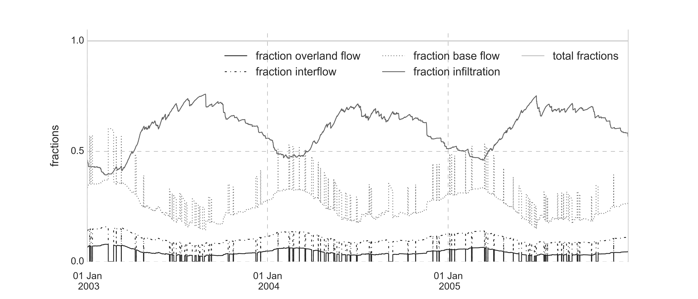

# flexible_vhm_implementation
Python implementation of the VHM approach by Willems P., published in Journal of Hydrology, with the title:

Willems, P. (2014). Parsimonious rainfall–runoff model construction supported by time series processing and validation of hydrological extremes – Part 1: Step-wise model-structure identification and calibration approach. Journal of Hydrology, 510, 578–590. doi:10.1016/j.jhydrol.2014.01.017

The model acts as a single function, called **VHM_flexible** and some support functions. The model is straightforward and easy implemented and I'm fully aware of the shortcomings of the implementation (considering lack of proper numerical implementation and tricky handling of fraction recalculation), however it was initially aimed to understand the way VHM itself was implemented, since the code of the original author was not fully accessible. However, the approach of using subflow filtering to stepwise calibrate the model is an interesting and worthwhile way of enhanced data-incorporation into lumped hydrological models.

    ```python
    def VHM_flexible(pars, constants, init_conditions,
                        structure_options, rain, pet):
        """
        Flexible and straight forward application of the VHM modelling approach
        as proposed by Willems P. (2014) and mase flexible with a set of modelling
        options

        Parameters
        ------------
        pars : list
            18 parameters for the model listed
        constants : list
            area and timestep in a sinlge list
        init_conditions : list
            initial conditions for soil storage and different routing elements
        structure_options : list
            * fracthand 'relative' or 'sequentialx' with x [1-4]
            * storhand 'linear' or 'nonlinear'
            * interflowhand True or False
            * infexcesshand True or False
            * nres_g/nres_i/nres_o string of 3 options, each [1-2], eg 211, 121,...
        rain : ndarray
            array with input rain observations
        pet : ndarray
            array with input pet observations

        Returns
        ---------
        outflows : ndarray
            columns q_out, q_overland, q_interflow, q_baseflow
            total flow, overland, interflow and baseflow
        fractions : ndarray
            clumns fs, fi, fb, fu, i.e. fractions of overland flow, interflow,
            base flow and infiltration
        moisture : ndarray
            mooisture content in time
        """
      ```

An application of the model to the Nete catchment, provides following model outputs:

* Modelled and observed discharge:


* Soil moisture in function of time


* Overland, inter- and baseflow modelled and filtered from the original discharge data serie:


* Fractionation of the incoming rainfall towards the different model components:
  * When the antecedent rainfall concept, describing the concept of infiltration excess is included:

  

    * When the antecedent rainfall concept, describing the concept of infiltration excess is not included:
    

When interested to explore the possibility of converting the VHM approach into a numerically-improved model, please start with having a look at *test_odespy_vhm.ipynb* in which I quickly showcase how the usage of [odespy](https://github.com/hplgit/odespy) provides a possibility of doing so.

However, when interested in ODE-style implementation of lumped hydrological models, please check [FUSE](http://jasper.eng.uci.edu/pdf/39.pdf). The model was reimplemented in Python by myself, see at https://github.ugent.be/pages/biomath/pyFUSE. This implementation also extends FUSE to fit NAM and PDM model structures. Integration is covered by scipy and odespy solvers.

For R-users, a wrapper of FUSE is available [here](https://github.com/ICHydro/r_fuse).
